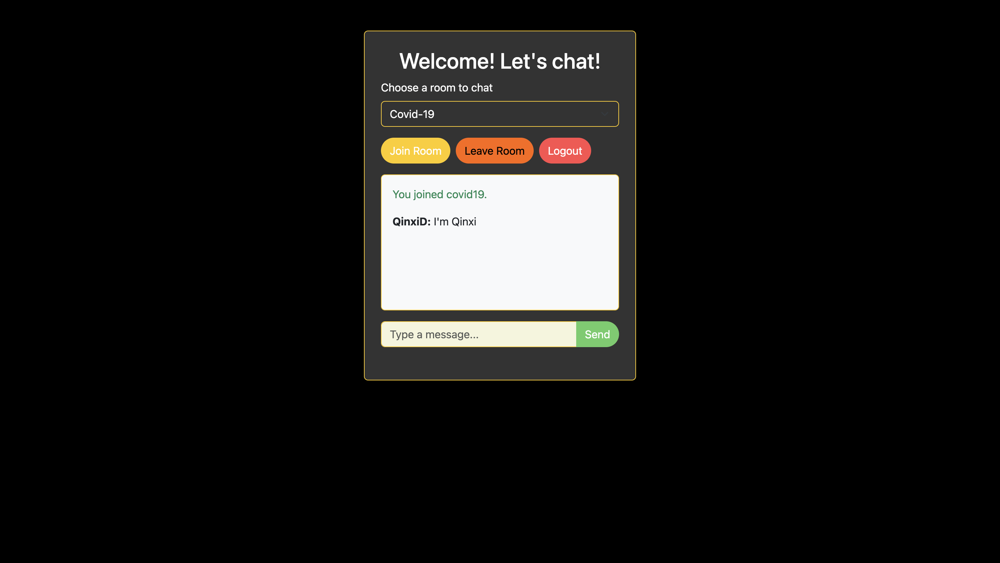

# Real-Time Chat Application

## Overview

This is chat application that allows users to sign up, log in, join chat rooms, send and receive messages instantly, and see typing indicators. The messages are stored in MongoDB, and the app uses Socket.io for real-time communication, ensuring a seamless chat experience.

## Screenshots

### Signup Page

### Login Page

### Home Page

### Chat from User01 Page

### Chat from User02 Page

### Chat Room Conversation Page

